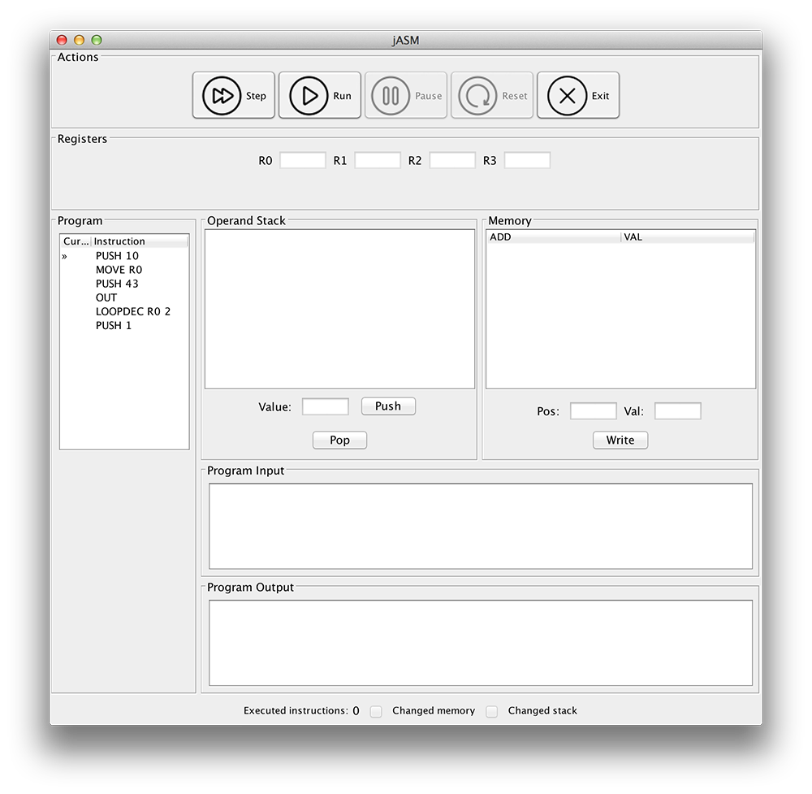

# jASM: Java-built ASM emulator and debugger 

## Usage

This project uses [Java 8](http://www.oracle.com/technetwork/java/javase/downloads/jdk8-downloads-2133151.html), so be sure to download it.

Then, build the project with whatever build tool you use. If you prefer it, you can download an already built jar from [here](https://dl.dropboxusercontent.com/u/29178650/jASM.jar).

Then, `cd` into your working directory and run `java -jar jASM.jar -h` to view the usage options. Be sure to take a look at the [examples](examples/) and the syntax [documentation](doc/Syntax.md).

Running `java -jar jASM.jar -m interactive` will start an interactive prompt where you will be able to enter your program.

To start the GUI, run it with the `-m window` option. Make sure to provide a valid asm source file.

#### Please note that this screenshot may be out of date, but it should give a good idea of the general look and features

## Contributing

Interested in contributing? Check out the [TODO](TODO.md) and the [coding style](doc/CodingStyle.md). Or, if you prefer it,
jump ahead and read some of the [example](examples/) files.

## Licensing

This software is distributed under the GPLv3 license. For more information, please check the [License](LICENSE).

This software uses the [Apache Commons CLI Library](http://commons.apache.org/proper/commons-cli/), distributed under the [Apache License 2.0](http://www.apache.org/licenses/LICENSE-2.0.txt).

Graphical Interface Icons by [Daniele De Santis](http://www.danieledesantis.net/) distributed under the [CC Attribution 4.0](http://creativecommons.org/licenses/by/4.0/legalcode) license.

Additional Icon work by [IconsMind](https://www.iconsmind.com).

